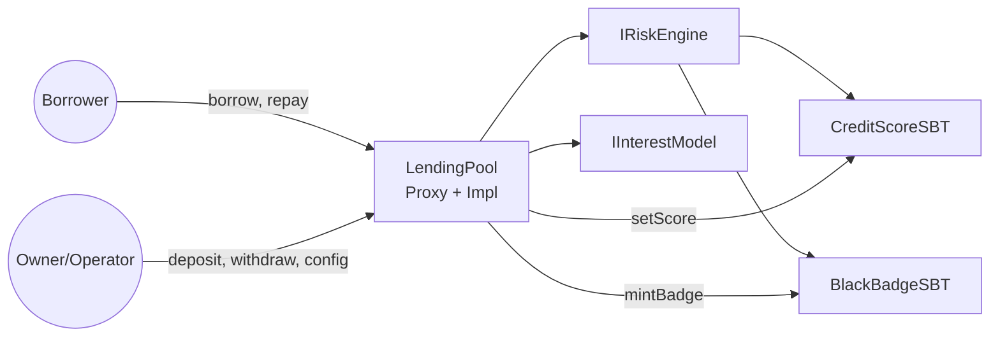

# Undercollateralized Lending v0

## Контекст
Это учебный прототип under/over‑collateralized lending, где требования к залогу снижаются по мере роста репутации (credit score), а дефолтеры получают “чёрную метку”.

В репозитории сохранена общая архитектурная идея (core + модули + proxy), но текущий код намеренно упрощён:
- оракулы/верификаторы/хуки (price/identity/reputation hook) не реализованы;
- вместо RBAC/ролей используется `Ownable` (1 админ);
- используется один ERC20 `token` и для займа, и для залога;
- один активный займ на заёмщика (`loanOf[borrower]`).

## Цель v0
- Зафиксировать минимальный core + ABI/точки расширения.
- Показать “money-flow” и lifecycle займа (borrow/repay/default) без усложнения бизнес‑логики.
- Подготовить основу под подключение дополнительных политик (оракул, identity/ZK, хуки) в следующих версиях.

## Ключевые решения

### 1) Core тонкий, политика — в модулях
Core (`src/core/LendingPool.sol`) отвечает за:
- хранение займа и учёт залога (`lockedCollateral`);
- перемещение средств (deposit/withdraw/borrow/repay);
- начисление комиссий и базовые проверки;
- вызов модулей политики.

Модули политики подключаются по интерфейсам:
- `IRiskEngine` — требования к залогу/лимитам и блок дефолтеров (`collateralRatioBps/maxBorrow/isDefaulter`);
- `IInterestModel` — расчёт долга во времени (`debt/debtWithPenalty`).

Текущее “дефолтное” наполнение:
- `src/modules/RiskEngine.sol` — скоринг → collateral ratio + запрет дефолтерам;
- `src/modules/InterestModelLinear.sol` — линейный APR + penalty APR.

### 2) Репутация через SBT (soulbound ERC‑721)
Используем два SBT:
- `src/tokens/CreditScoreSBT.sol` — хранит `score` (uint16), один токен на адрес, обновляется протоколом;
- `src/tokens/BlackBadgeSBT.sol` — “чёрная метка” дефолтера (один токен на адрес), mint при дефолте.

Soulbound‑поведение реализовано практично для v0: трансферы и approvals отключены (revert).
EIP‑5192 не реализован (можно добавить позже отдельно, если понадобится совместимость).

Важно: SBT принадлежат `LendingPool` (через `transferOwnership` после деплоя), чтобы core мог mint/update.

### 3) Money-flow v0 (что реально происходит на балансе)
Роли в v0 упрощены: админ = owner.

**Ликвидность**
- `depositLiquidity(amount)` — owner кладёт `token` в пул.
- `withdrawLiquidity(amount,to)` — owner может вывести только “свободную” ликвидность: `availableLiquidity() = balance - lockedCollateral`.

**Borrow**
- `borrow(amount, collateralAmount, duration)`:
  - ограничение на `duration`: `[minDuration, maxDuration]` (по умолчанию 4h..72h);
  - проверка лимита `riskEngine.maxBorrow(borrower)` и требований по залогу `riskEngine.collateralRatioBps(borrower)`;
  - залог переводится в пул и учитывается в `lockedCollateral`;
  - из `amount` удерживается `originationFeeBps` и отправляется в `treasury`;
  - заёмщик получает `amount - originationFee`.

**Repay**
- `repay(amount)`:
  - платеж поступает в пул (transferFrom);
  - если суммарно `repaid >= totalDebt`, займ закрывается, залог возвращается заёмщику;
  - с процентов берётся `protocolFeeBps` в `treasury`;
  - `CreditScoreSBT` увеличивается на `scoreIncrement` с капом `scoreFree`.

**Default**
- `markDefault(borrower)`:
  - callable любым (keeper‑модель);
  - разрешено только после `due + gracePeriod` (по умолчанию 24h);
  - займ закрывается, залог остаётся в пуле;
  - вызывающему платится `defaultBountyBps` от залога (стимул вызывать);
  - дефолтеру mint `BlackBadgeSBT`.

### 4) Конфиги и “админка”
Конфиги храним как storage‑поля с дефолтами и возможностью менять:
- `minDuration/maxDuration`
- `gracePeriod`
- `scoreFree/scoreIncrement`
- `protocolFeeBps/originationFeeBps`
- `defaultBountyBps`
- `treasury`

Есть батч‑обновление `setConfig(...)` + точечные сеттеры для совместимости/простоты.

### 5) Upgradeability (UUPS)
`LendingPool` разворачивается как UUPS‑upgradeable:
- логика в имплементации, state в proxy (`ERC1967Proxy`);
- имплементация защищена от повторной инициализации (`_disableInitializers()` в конструкторе);
- апгрейды разрешены только owner (`_authorizeUpgrade`).

## Ограничения/не‑цели v0 (важно для ожиданий)
- Нет оракулов и multi‑asset: один ERC20 `token`.
- Нет ликвидаций/аукционов/AMM‑продажи залога: дефолт просто удерживает collateral в пуле.
- Учёт `lockedCollateral` предполагает “обычный” ERC20 без rebasing/fee‑on‑transfer; иначе возможны рассинхронизации и DoS‑эффекты на `availableLiquidity()`.

## Диаграмма (v0)

